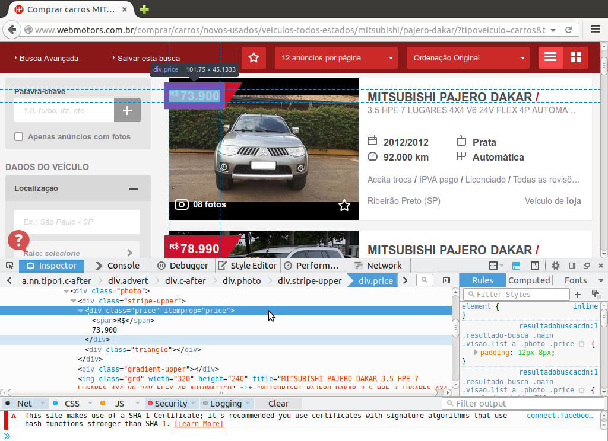
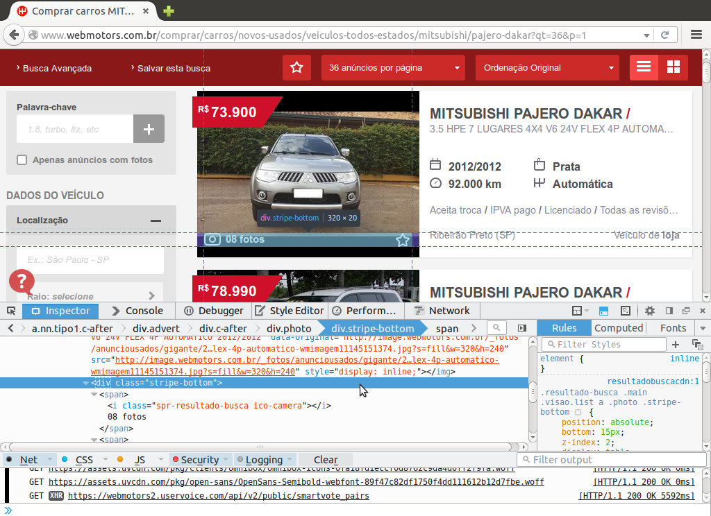
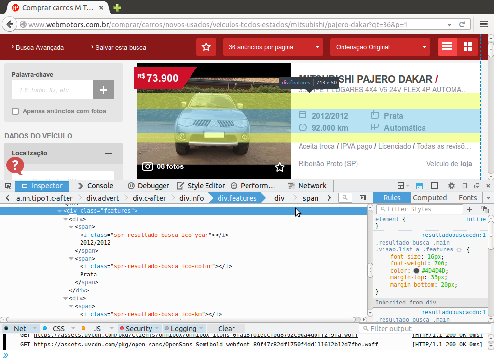

```{r setup, include = FALSE}
##-------------------------------------------
## Do documento
library(knitr)
opts_chunk$set(
    echo = FALSE,
    message = FALSE,
    warning = FALSE,
    results = "asis",
    tidy = FALSE,
    cache = TRUE,
    cache.path = "cache/")

##-------------------------------------------
## Do WebScraping
library(XML)
library(reshape)

##-------------------------------------------
## Da visualização gráfica
library(googleVis)
## Para renderização googleVis
op <- options(gvis.plot.tag = "chart")

library(rCharts)
## Para renderização rCharts
options(
  rcharts.mode = 'iframesrc', 
  rcharts.cdn = TRUE,
  RCHART_WIDTH = 800,
  RCHART_HEIGHT = 400
)

## Para utilizar o plotly é necessária a autenticação de usuário
## Os gráficos feitos por essa biblioteca são armazenados em sua conta
## web do site plotly
Sys.setenv("plotly_username" = "EduardoJr")
Sys.setenv("plotly_api_key" = "8l0idbciy0")
library(plotly)
library(ggplot2)
```

## Objetivos ##

Neste trabalho o objetivo é realizar *web scraping*, ou seja, extração
de dados, do site [WebMotors](http://www.webmotors.com.br/) com o
software R. Esse site contém anúncios de veículos de diversas marcas e
modelos e os anúncios trazem informações interessantes para um estudo
estatístico, como valor do veículo quilometragem rodada, ano (de
fabricação e do modelo), cor etc.

Ainda para apresentar as informações coletadas, este trabalho tem por
objetivo expôr novas formas de visualização de dados, explorando a
interatividade web. O software R vem crescendo fortemente no ramo de
visualizações interativas web, diversos pacotes estão sendo
implementados para esta finalidade e aqui iremos utilizar pelo menos
três.

Portanto, de forma resumida, os objetivos deste trabalho são:

* Extração de dados da página do
  [WebMotors](http://www.webmotors.com.br/)
* Visualização interativa dos dados coletados

## Inspecionando o site ##

Um primeiro passo para se realizar a extração de dados em páginas *web* é
entender como uma página realmente é. Acredito que todos, seja por acidente
ou curiosidade, já viram o código fonte de uma página. Pois bem é neste
código fonte que estão as informações que objetivamos.

Na página inicial do [WebMotors](http://www.webmotors.com.br/) aparece
as opções de veículo para ver os anúncios. Escolheremos a marca
**Mitsubish** e o modelo **Pajero Dakar**. Com essas informações vamos
inspecionar o primeiro anúncio para verificar onde estão as informações
dentro do código fonte.

Atualmente os navegadores tem uma funcionalidade de inspeção de página,
isso mostra em que parte do código fonte está o elemento
inspecionado. Vamos usufruir desta ferramenta para inspecionar o que
podemos extrair.

Verificamos que a informação mais relevante do anúncio o preço do
veículo, que chamaremos de `valor`, está dentro de uma tag `div` de
atributos `class="price"` e `itemprop="price"` e são essas informações
que possibilitam encontrar este valor e capturá-lo com o R. 

<!--  -->

Uma segunda informação contido no anúncio que seria interessante de se
coletar é o número de fotos, o nome dado será `nfotos`. Este valor esta

<!--  -->

Indo para a porção a direita do anúncio temos algumas informações logo
abaixo do título do anúncio, a esta informação será dado o nome de
`info`

<!--  -->

Temos também algumas característica destacadas com ícones que podem ser
extraídas e relacionadas com as demais variáveis. Este conjunto de
informações será chamado de `carac`

<!--  -->

Finalmente à direita na parte inferior do anuncio temos as últimas
informações que serão coletadas, são elas a cidade do veículo e de qual
proprietário ele é. Estas duas informações serão chamadas de `info2` no
código R.

<!--  -->

Com isso temos todas as informações necessárias para implementar o
código de extração desta primeira página.

## Implementando no R ##

INCLUIR PASSO A PASSO DO WEB SCRAP DA PRIMEIRA PÁGINA

Agora para ler e extrair os dados de todas as páginas que contém anúncio
da marca e modelo de veículo escolhido vamos incluir todos os passos de
extração em uma função para ser chamada a cada nova página.

```{r fun, eval = TRUE, echo = TRUE}
getWebMotors <- function(url) {
    ## Lendo a pagina
    pr <- readLines(con = url, warn = FALSE)
    ## Decodificando-a
    h <- htmlTreeParse(file = pr, asText = TRUE,
                       useInternalNodes = TRUE, encoding = "utf-8")
    ## Numero de anuncios nesta pagina * O numero de anuncios condiz com
    ## o número de tags h2 (titulo dos mesmos)
    n.anuncios <- length(
        xpathApply(h, "//h2[@itemprop=\"itemOffered\"]",fun = xmlValue)
    )
    ##-------------------------------------------
    ## Valor do veiculo
    valor <- getNodeSet(
        doc = h,
        path = "//div[@class=\"price\"]",
        fun = xmlValue
    )
    valor <- sapply(valor, FUN = function(text) {
        gsub(x = gsub(x = text, pattern = "[[:punct:]]",
                      replace = "", perl = TRUE),
             pattern = "^.*R([0-9]+).*", replacement = "\\1")
    })
    valor <- as.numeric(valor)
    ##-------------------------------------------
    ## Numero de fotos
    nfotos <- getNodeSet(
        doc = h,
        path = "//div[@class=\"stripe-bottom\"]//span",
        fun = xmlValue
    )
    nfotos <- nfotos[seq(1, n.anuncios * 2, 2)]
    nfotos <- sapply(nfotos, FUN = function(text) {
        gsub(x = text, pattern = "^([0-9]+).*", replacement = "\\1")
    })
    nfotos <- as.integer(nfotos)
    ##-------------------------------------------
    ## Informaçoes gerais
    info <- getNodeSet(
        doc = h,
        path = "//span[@class=\"version\"]",
        fun = xmlValue
    )
    info <- sapply(info, FUN = function(text) {
        gsub(x = text, "^([0-9]\\.[0-9]) .* (.*)$",
             replacement = "\\1")
    })
    ## info <- colsplit(info, split = ";", names = c("cil", "tipo"))
    ##-------------------------------------------
    ## Caracteristicas
    carac <- getNodeSet(
        doc = h,
        path ="//div[@class=\"features\"]//span",
        fun = xmlValue
    )
    carac <- unlist(carac)
    id <- xpathSApply(
        doc = h,
        path = "//div[@class=\"features\"]//span//i",
        fun = xmlGetAttr, "class")
    id <- sapply(as.list(id), FUN = function(text) {
        gsub(x = text, "^.*-([a-z]+)$", replacement = "\\1")    
    })
    carac <- unstack(data.frame(carac, id))
    carac$km <- as.numeric(
        sapply(as.list(carac$km), FUN = function(text) {
            if(text == "N/I") NA
            else
                gsub(x = gsub(x = text, pattern = "[[:punct:]]",
                              replace = "", perl = TRUE),
                     pattern = "^([0-9]+) km", replacement = "\\1")
        })
    )
    carac$year <- as.integer(
        sapply(as.list(carac$year), FUN = function(text) {
            gsub(x = text, "^([0-9]{4})/.*$", replacement = "\\1")
        })
    )
    ##-------------------------------------------
    ## Informações adicionais
    info2 <- getNodeSet(
        doc = h,
        path ="//div[@class=\"card-footer\"]//span",
        fun = xmlValue
    )
    local <- unlist(info2)[seq(1, n.anuncios * 2, 2)]
    anuncio <- unlist(info2)[seq(2, n.anuncios * 2, 2)]
    local <- sapply(as.list(local), FUN = function(text) {
        gsub(x = text, "^(.*) \\(([A-Z]{2})\\)$",
             replacement = "\\1;\\2")
    })
    local <- colsplit(local, split = ";", names = c("cidade", "estado"))
    ##-------------------------------------------
    ##-------------------------------------------
    ## Organizando a saida
    da <- list(
        valor = valor,
        nfotos = nfotos,
        cilindradas = info,
        ## cambio = info$tipo,
        cor = carac$color,
        km = carac$km,
        cambio = carac$shift,
        ano = carac$year,
        anuncio = as.character(anuncio),
        cidade = as.character(local$cidade),
        estado = as.character(local$estado)
    )
    return(da)
}
```

Perceba na função incluímos um passo que não havia na leitura da
primeira página, a obtenção do número de anúncios da página. Esta foi
uma dificuldade que só foi percebida quando realizado o procedimento
completo, pois com exceção da última página todas continham um número de
anúncios padrão (12, 24 ou 36) e as contas, para obtenção das posições
ímpares e pares das tags, era sempre a mesma, mas para última página os
números mudavam e valores `NA` preenchiam o `data.frame`. 

Agora com a função programada podemos montar o laço iterativo para
percorrer todas as páginas e coletar as informações desejadas. Primeiro
vamos encontrar quantos veículos anunciados existem e em quantas páginas
eles estão dispostos.

```{r extrai1, echo = TRUE, results = "markup", eval = TRUE}
##======================================================================
## Extração de dados de todos os veiculos no site webMotors

##-------------------------------------------
## Lendo a primeira página para descobrir o total de veículos

url <- paste0("http://www.webmotors.com.br/comprar/carros/",
              "novos-usados/veiculos-todos-estados/mitsubishi/",
              "pajero-dakar?qt=36&o=1&p=1")
pr <- readLines(con = url, warn = FALSE)

h <- htmlTreeParse(file = pr, asText = TRUE,
                   useInternalNodes = TRUE, encoding = "utf-8")

nveiculos <- getNodeSet(
    doc = h,
    path = "//span[@class=\"size-xbigger\"]",
    fun = xmlValue
)

nveiculos <- as.numeric(
    gsub(x = as.character(nveiculos),
         "^([0-9]+) .*$", replacement = "\\1")
)

nanuncios <- 36 ## Argumento `qt` na url, pode assumir 12, 24 ou 36
npages <- ceiling(nveiculos / nanuncios)

```

Com isso podemos montar nosso `data.frame` e preenchê-lo com os
resultados da função `getWebMotors(...)`. Optou-se pela construção
do `data.frame` geral em branco, pois sistemas do tipo `rbind`, `cbind`
ou `append` são caros computacionalmente.

```{r extrai2, echo = TRUE, results = "markup", eval = TRUE}
##----------------------------------------------------------------------
## Fazendo o processo de extração iterativamente para as `npages`
## páginas 

da <- data.frame(
    valor = vector("numeric", nveiculos),
    nfotos = vector("integer", nveiculos),
    cilindradas = vector("character", nveiculos),
    ## cambio = info$tipo,
    cor = vector("character", nveiculos),
    km = vector("numeric", nveiculos),
    cambio = vector("character", nveiculos),
    ano = vector("integer", nveiculos),
    anuncio = vector("character", nveiculos),
    cidade = vector("character", nveiculos),
    estado = vector("character", nveiculos),
    stringsAsFactors = FALSE
)

last <- 0
for(i in 1:npages) {
    ## Montando as urls
    url <- paste0("http://www.webmotors.com.br/comprar/carros/",
                  "novos-usados/veiculos-todos-estados/mitsubishi/",
                  "pajero-dakar?qt=", nanuncios, "&o=1&p=", i)
    ## Extraindo os dados
    resul <- getWebMotors(url = url)
    ## Posições de referencia
    pos <- last + 1
    last <- nanuncios * i
    x <- pos:last
    if( i == npages) x <- pos:nveiculos
    ## Preenchendo o data frame
    da$valor[x] <- resul$valor
    da$nfotos[x] <- resul$nfotos
    da$cilindradas[x] <- resul$cilindradas
    da$cor[x] <- resul$cor
    da$km[x] <- resul$km
    da$cambio[x] <- resul$cambio
    da$ano[x] <- resul$ano
    da$anuncio[x] <- resul$anuncio
    da$cidade[x] <- resul$cidade
    da$estado[x] <- resul$estado
}

```

Uma dificuldade do processo de *web scraping* é que as páginas *web*
geralmente são dinâmicas, não no sentido computacional (JavaScript,
Ajax etc.), mas no sentido de que há anúncios sendo adicionados e
excluídos a todo momento. No início deste trabalho foram consultados `r
nrow(read.table("pajero-dakar.csv", header = TRUE, sep = ";"))`
anúncios, hoje são `nrow(da)`.

## Visualizando os dados ##

Finalmente com os dados extraídos podemos ir para a visualização dos
dados obtidos. Podemos partir para as visualizações. E neste trabalho
vamos explorar recursos interativos do R para tal tarefa.

Várias bibliotecas em R permitem a elaboração de gráficos interativos
aqui optamos por utilizar recursos de três delas: `rCharts`, `googleVis`
e `plotly`.

Embora que já realizada uma higienização dos dados no momento da coleta,
porém algumas mudanças foram feitas posteriormente e são elas:

* Padronizar as cores dos veículos `cor` deixando-as todas minúsculas
* Para melhor visualização (principalmente devido a escala), trabalharemos
  com o logaritmo de base 10 do preço dos veículos `valor`
  ($\log_{10}(\text{`valor`})$)
* Por uma limitação de interatividade (não permite caracteres especiais
  em função javascript para colorir em `rPlot(...)`)

```{r, echo = TRUE}
##-------------------------------------------
## Padronizando o conjunto de dados
da$lvalor <- log10(da$valor)
da$cor <- tolower(da$cor)
da$motor <- as.factor(paste0("v", da$cilindradas * 1000))
```

A partir destas mudanças temos o resumo das variáveis numéricas abaixo:

```{r, results = "markup"}
ind_num <- sapply(da, FUN = function(x) is.numeric(x) || is.integer(x))
summary(da[, ind_num])
```

E para as não numéricas:

```{r, results = "markup"}
ind_num <- sapply(da, FUN = function(x) is.numeric(x) || is.integer(x))
summary(da[, !ind_num])
```
Com isso já podemos imaginar alguns gráficos a serem elaborados para
melhor visualização destas `r nrow(da) - 2` variáveis.

### Gráficos univariados ###

Para verificar a disposição dos anúncios para cada variável extraído
iremos elaboras gráficos univariados. O primeiro deles, logo abaixo,
exibe o número de veículos para cada cor encontrada nos anúncios. 

#### Frequência de anúncios pelas cores dos veículos ####

```{r, fig.height = 8, fig.width = 8}
##-------------------------------------------
rp <- nPlot(~ cor, data = da[order(da$cor),], type = 'pieChart')
rp$chart(color = c("blue", "#D0D0D0", "#5C5C5C", "gold", "orange",
                   "brown", "#949494", "black", "green", "red",
                   "#6B1010"))
rp
```

Percebemos que há uma predominância das cores `branco`, `preto` e
`prata`. Portanto reagrupamos as cores para continuidade da análise.

```{r, echo = TRUE}
##-------------------------------------------
## Recategorizando as cores
da$cor[!(da$cor %in% c("branco", "preto", "prata"))] <- "vários"
```

#### Frequências pelos anos de fabricação ####

```{r}
##-------------------------------------------
resumo <- with(da, aggregate(lvalor, by = list(ano),
                             FUN = function(x) length(x)))
names(resumo) <- c("AnoFabricação", "Frequência")

rp <- nPlot(Frequência ~ AnoFabricação, 
            data = resumo, 
            type = 'multiBarChart')
## ## Necessidade de um script java para inclusão de titulo
## rp$templates$script <- paste0(
##     "http://timelyportfolio.github.io/",
##     "rCharts_nvd3_templates/chartWithTitle.html")
## rp$set(title = paste("Densidade do logaritmo de base 10 dos ",
##                      "valores (R$) dos veículos"))
rp
```

Neste gráfico temos a disposição do ano de fabricação dos veículos e
notamos que há uma disposição simétrica em torno de 2012 da frequência
de veículos em cada ano. Além disso conseguimos identificar um anúncio
equivocado, pois temos uma obervação para o ano de fabricação 2016
(equívoco ou temos um carro do futuro a venda?). Supomos o ano de 
fabricação deste veículo como 2015 no decorrer do estudo.

```{r echo = TRUE}
##-------------------------------------------
## Corrigindo anuncio equivocado
da[da$ano == 2016, ]$ano <- 2015
```

#### Frequência de anúncios pelo Estado de origem ####

```{r}
## ## http://www.suapesquisa.com/geografia/siglas_estados_brasileiros.htm
## estados <- read.table("clipboard", encoding = "latin1", sep = "\t",
##                       stringsAsFactors = FALSE)
estados <- c("Acre", "Alagoas", "Amazonas", "Bahia", "Ceará",
             "Distrito Federal", "Espírito Santo", "Goiás", "Maranhão",
             "Minas Gerais", "Mato Grosso do Sul", "Mato Grosso",
             "Pará", "Paraíba", "Pernambuco", "Piauí", "Paraná",
             "Rio de Janeiro", "Rio Grande do Norte", "Rondônia",
             "Rio Grande do Sul", "Santa Catarina", "Sergipe",
             "São Paulo", "Tocantins")
## cbind(levels(da$estado), estados)
levels(da$estado) <- estados

da2 <- data.frame(table(da$estado))
names(da2) <- c("id", "cont")
da2$id <- as.character(da2$id)
names(da2) <- c("estados", "anúncios")


GeoStates <- gvisGeoChart(
    data = da2,
    locationvar = "estados",
    colorvar = "anúncios",
    options = list(
        region = "BR", 
        displayMode = "regions", 
        resolution = "provinces",
        width = "100%", height = 500))
plot(GeoStates)
```

Agora observando a frequência de anúncios por estado, temos a
predominância de São Paulo com `da2[da2$estados == "SP", ]$anúncios` e
com maiores contagens para as regiões Sudeste e Sul.

##### Densidade do preço dos veículos #####

```{r}
##-------------------------------------------
dn <- density(da$lvalor)
rp <- nPlot(y ~ x, data = data.frame(x = dn$x, y = dn$y), 
            type = 'stackedAreaChart')
rp$xAxis(axisLabel = "Logaritmo dos valores (R$) dos veículos")
## ## Necessidade de um script java para inclusão de titulo
## rp$templates$script <- paste0(
##     "http://timelyportfolio.github.io/",
##     "rCharts_nvd3_templates/chartWithTitle.html")
## rp$set(title = paste("Densidade do logaritmo de base 10 dos ",
##                      "valores (R$) dos veículos"))
rp
```

Para a variável de maior interesse nesse estudo, o preço dos veículos,
temos no gráfico acima, a densidade empírica estimada do logaritmo de
base 10 e notamos a assimetria da distribuição (à direita) com a moda
`r round(dn$x[which.max(dn$y)], 2)`, a mediana
`r round(median(da$lvalor), 2)` e a média `r round(mean(da$lvalor), 2)`.

### Gráficos multivariados ###

Nesta seção estudaremos as relações entre as variáveis do estudo.

#### Preço vs km por anúncio ####

```{r}
##-------------------------------------------
rp <- rPlot(lvalor ~ km | anuncio, data = da,
            type = "point", color = "motor")
rp$guides(
    x = list(title = "Quilômetros rodados" ),
    y = list(title = "Logaritmo de base 10 dos valores dos veículos (R$)"),
    color = list(
        scale = "#! function(value){
                color_mapping = {v3200: 'black', v3500:'#949494'}
                return color_mapping[value];
                } !#", title = "Motor"))
rp$set(title = paste("Dispersão dos logaritmo dos preços com relação",
                      "aos quilômetros rodados"))
rp
```

#### Frequência de anúncios por anunciante e cor ####

```{r}
##-------------------------------------------
resumo <- with(da, aggregate(lvalor, by = list(anuncio, cor),
                             FUN = function(x) length(x)))
rp <- nPlot(x ~ Group.1, group = "Group.2",
            data = resumo, type = "multiBarChart")
rp$chart(color = c("#D0D0D0", "#5C5C5C", "black", "#1F77B4"))
## ## Necessidade de um script java para inclusão de titulo
## rp$templates$script <- paste0(
##     "http://timelyportfolio.github.io/",
##     "rCharts_nvd3_templates/chartWithTitle.html")
## rp$set(title = paste("Logaritmo de base 10 dos valores",
##                      "dos veículos (R$) por anunciante"))
rp
```

#### Preço vs número de fotos do anúncios ####

```{r}
##======================================================================
## Plotly
## Usaremos a biblioteca ggplot2, passando o objeto gráfico para a
## função ggplotly, isso criará um gráfico interativo em sua conta web
## e, como estamos em um arquivo markdown já inclui a url do gráfico
## realizado em um iframe 

##----------------------------------------------------------------------
## Valor vs numero de fotos por cilindrada
gg <- ggplot(da, aes(x = factor(nfotos), y = lvalor)) +
    xlab("Número de fotos do anúncio") +
    ylab("Logaritmo de base 10 dos valores dos veículos (R$)") +
    theme_bw() +
    geom_boxplot()

ggplotly(gg)
```

#### Preço médio por estado ####

```{r}

resumo <- with(da, aggregate(lvalor, by = list(estado), mean))

map <- data.frame(
    popup = paste(resumo[, 1], "<BR>Média do log10(valor) = ",
                  round(resumo[, 2], 2)),
    lat = c(-9.975, -9.666, -3.102, -12.971, -3.717, -15.78, -20.319,
            -16.679, -2.53, -19.921, -20.443, -15.596, -1.456, -7.115,
            -8.054, -5.089, -25.428, -22.903, -5.795, -8.762, -30.033,
            -27.597, -10.911, -23.548, -10.213),
    lon = c(-67.81, -35.735, -60.025, -38.511, -38.543, -47.93, -40.338,
            -49.254, -44.303, -43.938, -54.646, -56.097, -48.504,
            -34.863, -34.881, -42.802, -49.273, -43.208, -35.209,
            -63.904, -51.23, -48.549, -37.072, -46.636, -48.36)
)
map$latlon <- with(map, paste(lat, lon, sep = ":"))

Map <- gvisMap(map,
               locationvar = "latlon",
               tipvar = "popup", 
               options = list(
                   showTip = TRUE, 
                   showLine = TRUE, 
                   enableScrollWheel = TRUE,
                   mapType = 'terrain', 
                   useMapTypeControl = TRUE,
                   width = "800px",
                   height = "800px"))
plot(Map)
```

#### Dispersão considerando todas as variáveis ####

```{r}
##-------------------------------------------
rp <- rPlot(lvalor ~ km, data = da,
            type = "point", color = "motor")
rp$addControls("x", value = "km",
               values = c("km", "ano"))
rp$addControls("y", value = "lvalor",
               values = c("lvalor", "valor", "nfotos"))
rp$addControls("color", value = "motor",
               values = c("motor", "cambio", "anuncio", "cor", "estado"))
rp$set(dom = 'chartcontrols')
rp
```
<style>#iframe-chartcontrols{height: 400px; width: 1000px}</style>


#### Frequência dos anúncios por preço, anunciante e tipo de câmbio ####

```{r}
##-------------------------------------------
da$lvalorCateg <- cut(da$lvalor, 5)
resumo <- with(da,
               aggregate(
                   lvalor,
                   by = list(lvalorCateg, cambio, anuncio),
                   FUN = function(x) length(x)))
names(resumo) <- c("lvalorCateg", "Cambio", "Anunciante", "Freq")

rp <- nPlot(Freq ~ lvalorCateg, group = "Cambio", data = resumo,
      type = "multiBarChart", id = 'chartfilter')
rp$addFilters("Anunciante")
rp$set(dom = 'chartfilter')
rp
```
<style>#iframe-chartfilter{height: 700px;  width:900px}</style>


## Referências ##

*  [*Web Scraping* Corrida São Silveste](http://blog.leg.ufpr.br/archives/250)
Tutorial de *Web Scraping* pelo Blog do LEG
* [*Web Scraping* em cifras de música](http://blog.leg.ufpr.br/archives/195)
Tutorial de *Web Scraping* pelo Blog do LEG
* [rCharts.io](http://ramnathv.github.io/rCharts/)
Página do pacote **rCharts**
* [NVD3 with rCharts](http://ramnathv.github.io/posts/rcharts-nvd3/)
Post com exemplos NVD3 do **rCharts** (função `nPlot(...)`)
* [GoogleCharts](https://developers.google.com/chart/interactive/docs/gallery)
Galeria de gráficos do Google
* [googleVis vignettes](https://cran.r-project.org/web/packages/googleVis/vignettes)
Exemplos do pacote **googleVis** no CRAN
* [Plotly](https://plot.ly/)
Página principal do **Plotly**
